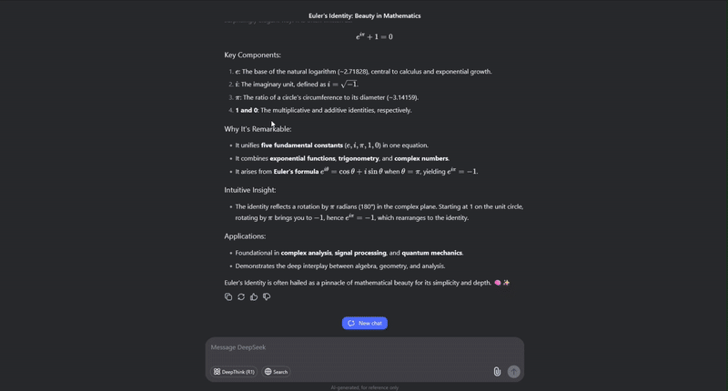

  <h1>
    
    to
    
    Markdown
  </h1>
  

    Simple web app that helps you copy LaTeX formulas from LLMs and paste them into Markdown documents.
  

  

  <a href="https://daetojostka.github.io/Latex-to-Md/">
    https://daetojostka.github.io/Latex-to-Md/
  </a>

## Features

- Converts LaTeX math formulas to Markdown-compatible syntax
- Real-time preview with MathJax rendering
- Auto copy to clipboard functionality

## License

This project is licensed under the [MIT License](LICENSE).
